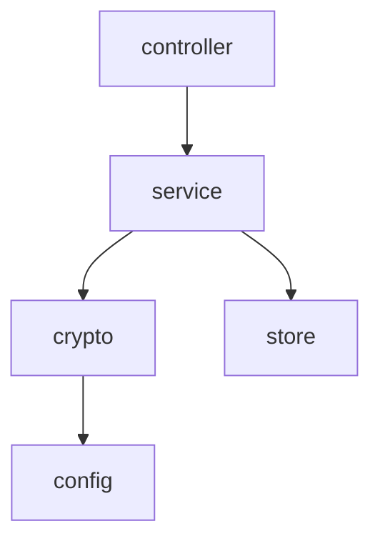

# eudi-wallet-exploration-backend


## :mag: Overview

This guide walks through building a very minimal but functional digital identity wallet ecosystem from scratch.
The goal is not about production quality &mdash; it is to give you a genuine hard-won understanding of the credential 
issuance and presentation flows.

By the end, you will have built three core concepts:

- **Issuer** &mdash; a Kotlin Spring Boot backend that issues verifiable credentials to a wallet
- **Wallet** &mdash; an Android application that receives, stores, and presents credentials
- **Verifier** &mdash; a Kotlin Spring Boot backend that requests and validates credential presentations

---

## :bulb: Key Concepts

### The Ecosystem

The EUDI Wallet world involves three roles:

| Role         | Responsibility                                                                         |
|--------------|----------------------------------------------------------------------------------------|
| **Issuer**   | Issues credentials to a wallet (e.g. a government issuing a digital ID)                |
| **Wallet**   | Holds credentials and presents them when requested                                     |
| **Verifier** | Requests proof of a credential from a wallet (e.g. an age check at a service provider) |

### OID4VCI &mdash; OpenID for Verifiable Credential Issuance

This is the protocol the **Issuer** uses to get a credential into the **Wallet**. The high level flow is:

1. Issuer generates a credential offer (URI or QR code)
2. Wallet receives the offer and fetches issuer metadata
3. Wallet authenticates with the Issuer using a pre-authorised code
4. Wallet requests a credential, proving possession of its key
5. Issuer returns a signed credential
6. Wallet stores it

### OpenID4VP &mdash; OpenID for Verifiable Presentations

This is the protocol the **Verifier** uses to request proof from the **Wallet**. The high-level flow is:

1. Verifier generates an authorisation request (URI or QR code)
2. Wallet receives the requests and identifies matching credentials
3. Wallet shows a consent screen to the user
4. Wallet constructs a Verifiable Presentation &mdash; a signed, selective disclosure of the credential
5. Wallet sends the presentation to the Verifier
6. Verifier validates it and returns a result

### Key Terms

| Term                         | Meaning                                                                                                               |
|------------------------------|-----------------------------------------------------------------------------------------------------------------------|
| VC (Verifiable Credential)   | A tamper-evident credential issued by an Issuer                                                                       |
| VP (Verifiable Presentation) | A VC (or subset of one) wrapped and signed by the Wallet for a specific Verifier                                      |
| SD-JWT                       | Selective Disclosure JWT &mdash; the credential format used in EUDI; allows the holder to reveal only specific claims |
| DID                          | Decentralised Identifier &mdash; a way to identify issuers/wallets without a central authority                        |
| Credential Offer             | A URI the Issuer produces that kicks off the OID4VCI flow                                                             |
| Presentation Definition      | A JSON structure the Verifier sends describing what credentials and claims it needs                                   |
| c_nonce                      | A challenge nonce the Issuer sends so the wallet can prove cryptographic key possession                               |
| Pre-Authorised Code          | A one-time code that allows a wallet to skip the full OAuth login and go straight to token exchange                   |

---

## :file_folder: Project Structure

Two separate repositories:

```text
eudi-wallet-exploration-backend     <- Kotlin Spring Boot (Issuer and Verifier)
eudi-wallet-exploration-android     <- Kotlin + Jetpack Compose (Wallet)
```

### Dependency Graph



---

## :hammer_and_wrench: Tech Stack

| Component            | Technology               | Reason                                         |
|----------------------|--------------------------|------------------------------------------------|
| Backend              | Kotlin + Spring Boot     | &mdash;                                        |
| Android              | Kotlin + Jetpack Compose | &mdash;                                        |
| Credential Format    | SD-JWT (simplified)      | Used in EUDI ARF; mdoc is out if scope for now |
| Crypto               | Nimbus JOSE + JWT        | Used in official EUDI Kotlin libraries         |
| Networking (Android) | Ktor Client              | Consistent with EUDI library internals         |

---

## :classical_building: Backend Architecture

The backend hosts both the **Issuer** and **Verifier** in a single Spring Boot application. In a real system these
would be separate services, but combining them keeps the setup simple for exploration purposes.

The application is structured in three layers:

```text
config/         <- Spring configuration and bean wiring
controller/     <- Handles HTTP requests and responses
crypto/         <- Key management and JWT signing/verification utils
model/          <- Data classes for requests, responses, and internal state
service/        <- Business logic; orchestrates flows; calls crypto service
store           <- In-memory state (tokens, nonces, sessions)
```

---

## :construction: How to Build

### Project Setup

Create a new Spring Boot project via [start.spring.io]() with:

- Language: Kotlin
- Build: Gradle (Kotlin DSL)
- Dependencies: Spring Web

Add to `build.gradle.kts`:

```Gradle
implementation("com.nimbusds:nimbus-jose-jwt:9.37.3")
```

Create the full package structure described in the [Backend Architecture](#backend-architecture) section above.
Stub out all classes with empty bodies before implementing anything &mdash; this forces you to think about
responsibilities before logic.

---

### Issuer (OID4VCI)

**Goal:** Implement the Issuer side of the OID4VCI flow &mdash; metadata, credential offer, token exchange, and 
credential issuance.

#### Issuer Metadata

Implement `IssuerMetadataController`:

```Kotlin
@RestController
class IssuerMetadataController(private val issuerService: IssuerService) {
    @GetMapping("/.well-known/openid-credential-issuer")
    fun getMetadata(): IssuerMetadata = issuerService.getMetadata()
}
```

`IssuerMetadata` and its nested types:

```Kotlin
data class CredentialSupported(
    val format: String,
    val id: String,
    val claims: Map<String, Any>
)

data class IssuerMetadata(
    @JsonProperty("credential_issuer") val credentialIssuer: String,
    @JsonProperty("credential_endpoint") val credentialEndpoint: String,
    @JsonProperty("token_endpoint") val tokenEndpoint: String,
    @JsonProperty("credentials_supported") val credentialsSupported: List<CredentialSupported>
)
```

`IssuerService.getMetadata()` returns a hardcoded `IssuerMetadata` with base URL `http://10.0.2.2:8080`.

This endpoint exists to allow wallets to discover the issuer's capabilities and all endpoint URLs here before starting
any flow.

---

#### Credential Offer

Implement `CredentialOfferController`:

```Kotlin
@RestController
class CredentialOfferController(private val issuerService: IssuerService) {
    @GetMapping("/credential-offer")
    fun getCredentialOffer(): ResponseEntity<String> {
        val offerUri = issuerService.generateCredentialOffer()
        return ResponseEntity.ok(offerUri)
    }
}
```

In `IssuerService.generateCredentialOffer()`:

1. Generate a UUID pre-authorised code
2. Store it via `TokenStore.storeCode(code)`
3. Build and return the credential offer as a URI string.

```text
openid-credential-offer://?
credential_offer={"credential_issuer":"http://10.0.2.2:8080","credentials":
["ExplorationCredential"],"grants":{"urn:ietf:params:oauth:grant-type:pre-
authorized_code": {"pre-authorized_code":"<uuid>","user_pin_required":false}}}
```

---

#### Token Exchange
Implement `TokenController`:

```Kotlin
@RestController
class TokenController(private val tokenService: TokenService) {
    @PostMapping("/token", consumes = [MediaType.APPLICATION_FORM_URLENCODED_VALUE])
    fun token(@RequestParam params: MultiValueMap<String, String>): TokenResponse {
        val grantType = params.getFirst("grant_type") ?: error("Missing grant type")
        val code = params.getFirst("pre-authorized_code") ?: error("Missing code")
        return tokenService.exchange(grantType, code)
    }
}
```

`TokenResponse`:

```Kotlin
data class TokenResponse(
    val accessToken: String,
    val tokenType: String = "Bearer",
    val expiresIn: Int = 300,
    val cNonce: String
)
```

In `TokenService.exchange()`:

1. Validate `grant_type` is `urn:ietf:params:oauth:grant-type:pre-authorized_code`
2. Call `TokenStore.validateCode(code)` &mdash; throw a `400` if not found
3. Generate UUID access token and UUID c_nonce
4. Call `TokenStore.storeToken(accessToken, cNonce)`
5. Invalidate the code so it cannot be reused
6. Return `TokenResponse`

The `c_nonce` is what the wallet uses as a signed proof JWT when requesting the credential, proving it controls the
private key it is registering with the issuer.

---

#### Credential Issuance

Implement `CredentialController`:

```Kotlin
@RestController
class CredentialController(private val credentialService: CredentialService) {
    @PostMapping("/credential")
    fun issueCredential(
        @RequestHeader("Authorization") authorization: String,
        @RequestBody request: CredentialRequest
    ): CredentialResponse {
        val accessToken = authorization.removePrefix("Bearer ").trim()
        return credentialService.issue(accessToken, request)
    }
}
```

`CredentialRequest`:

```Kotlin
data class CredentialProof(
    val proofType: String,
    val jwt: String
)

data class CredentialRequest(
    val format: String,
    val proof: CredentialProof?
)
```

`CredentialResponse`:

```Kotlin
data class CredentialResponse(
    val credential: String,
    val format: String = "vc+sd-jwt"
)
```

In `CredentialService.issue()`:

1. Call `TokenStore.validateToken(accessToken)` &mdash; throw `401` if not found
2. Build a `JWTClaimsSet` with `name`, `age_over_18`, `iss`, `sub`, `iat`
3. Call `CryptoService.sign(claims)` to get the signed JWT string
4. Return `CredentialResponse(credential = signedJwt)`

In `CryptoService.sign()`:

```Kotlin
fun sign(claims: JWTClaimsSet): String {
    val header = JWSHeader.Builder(JWSAlgorithm.ES256).build()
    val jwt = SignedJWT(header, claims)
    jwt.sign(ECDSASigner(keyPair.private as ECPrivateKey))
    return jwt.serialize()
}
```

**Checkpoint:** This is now a minimal, working OID4VCI Issuer. Exercise the full flow using Postman or curl &mdash; fetch metadata, get
a credential offer, exchange the code for a token, and request a credential. Confirm the returned JWT decodes correctly
at [jwt.io](https://www.jwt.io/).

---
